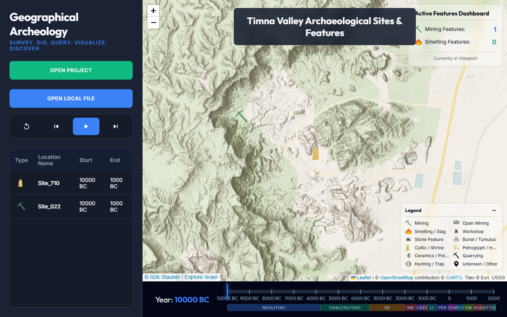
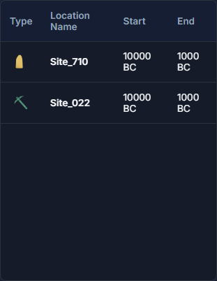
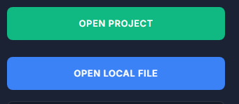
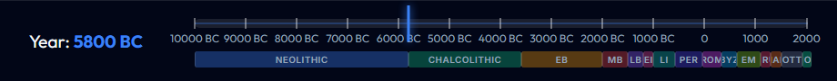

# GeoArcheology Visualization Dashboard: User Guide

Welcome to the **GeoArcheology Visualization Dashboard**, an interactive web application designed to help you explore and analyze geographic and temporal trends in archaeological contens like sites and surveys.

---

## 1. Application Overview

The dashboard is structured into three main interactive sections:

1. **Control Sidebar (Left Panel):** Used for loading datasets, controlling animation playback, and inspecting tabular data.
2. **Interactive Map (Center Panel):** Renders archaeological location markers.
3. **Time Ruler (Bottom Panel):** A visual timeline representing the active era.

---

## 2. Key Features and Controls

### A. Interactive Data Table
The Interactive Data Table shows all archaeological records that were active in the current timestamp.

* **Rows:** Each row displays the properties of a single site: **Type** (represented by color-coded indicator icons), **Name**, and the period in which it was active - **Start Year**, and **End Year**.
clicking a table row selects the coresponding site on the map.

### B. Data Source Management
You can load datasets using two methods:

* **Open Project:** Click this button to open a dropdown of all available datasets (e.g., Timna Data, Iron Age Cities, Decapolis).
* **Open Local File:** Click this button to upload a local `.csv` file directly from your computer. The dashboard will automatically parse and display it (CSV format description TBD)

### C. Animation and Playback Controls
Move forward and backward in time:

* **Reset (🔄):** Jumps the timeline back to the initial start year.
* **Previous Event (⏮️):** Moves the timeline one step backward to the previous chronological event, which can be start or end date of a site activity
* **Play / Pause (▶️ / ⏸️):** Automatically animates the map over the timeline to show dynamic urban shifts.
* **Next Event (⏭️):** Moves the timeline one step forward to the next chronological event, which can be start or end date of a site activity

### D. Time Ruler & Period Strip
* **Interactive Marker:** The marker shifts along the timeline as the year progresses.
* **Period Indicators:** Visual colored strips segmenting historical eras (e.g., Early Bronze Age, Iron Age II, etc.).
* **Year Display:** Large display highlighting the active historical year.

---

## 3. Responsive & Mobile Support
The dashboard is fully optimized for mobile devices:
* **Mobile Drawer Sidebar:** A hamburger button collapses the control panel on mobile screens, leaving the map clear.
* **Floating Map Navigation:** Floating navigation buttons appear directly on the map for easy one-handed stepping through events.
